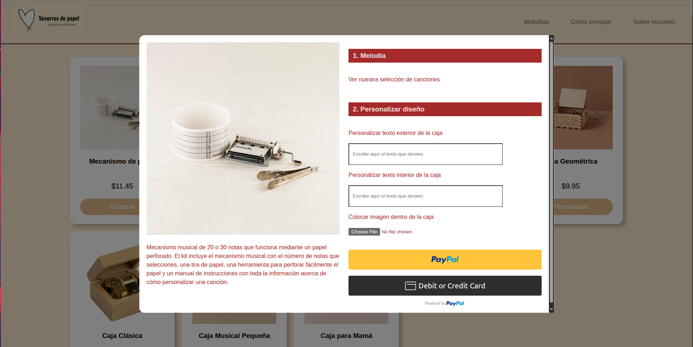
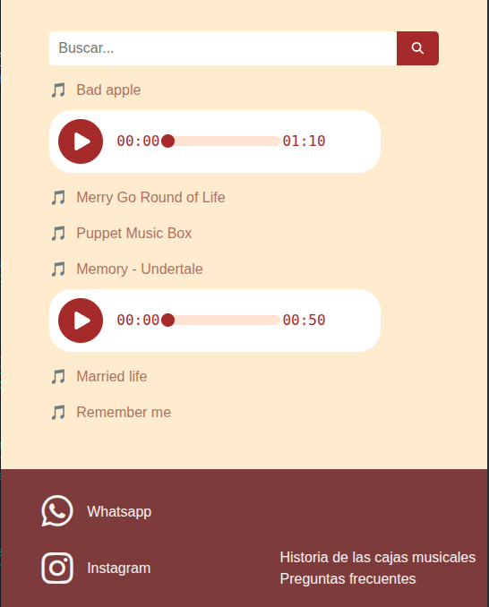

# Music Box Store

This is a personal project I developed to strengthen my skills as a full-stack developer. It was also my first time working with React, which allowed me to learn the fundamentals of component-based architecture, state management, and frontend best practices. Additionally, the project is inspired by my long-term goal of eventually creating and selling personalized music boxes, which made the development process especially motivating and enjoyable.

## Authors

- [Joshua Jiménez Delgado](https://github.com/JoshJD11)

## How to run

### Prerequisites
- Node.js (last version recommended)
- npm

### Steps
1. Clone the repository:
   ```bash
   https://github.com/JoshJD11/ReactStuff.git
   ```
2. Install general dependencies:
    ```bash
        cd "Web Development/Music Box Store"
        npm install
    ```

3. Install backend dependencies:
    ```bash
        cd Backend
        npm install
    ```
4. Install frontend dependencies:
    ```bash
        cd ..
        cd WebPage
        npm install
    ```
5. Run the application:
    ```bash
        cd ..
        npm run dev
    ```
## Screenshots

This are the most important sections of the application.





(The images used in the Application are temporal because they aren't mine, is just for aesthetic purposes and they won't be used in the final version).
